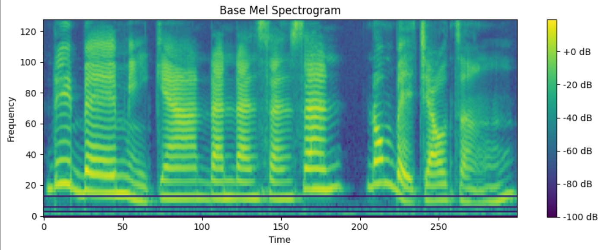
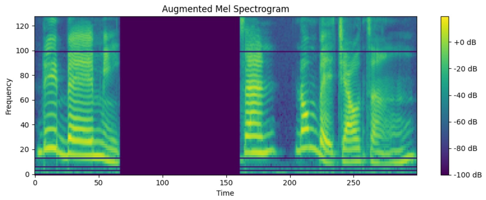

# README

## 項目簡介
本項目旨在利用 Deep Speech 2 的基礎架構，使用 [assemblyAI](https://colab.research.google.com/drive/11WlN2MIGL4NDxE_mxVZYaG43PYaSOmf1#scrollTo=XZodve8PGKfS) 的[架構](https://colab.research.google.com/drive/11WlN2MIGL4NDxE_mxVZYaG43PYaSOmf1#scrollTo=XZodve8PGKfS)對音頻數據進行處理和建模，包含音頻預處理、特徵提取、數據增強以及基於深度學習模型的語音識別研究。

---

## 功能特點
1. **音頻處理與轉換**
   - 使用 `torchaudio` 加載音頻文件，進行基本的音頻波形轉換。
   - 提供 Mel 頻譜圖（Mel Spectrogram）轉換。

2. **數據增強**
   - 包含頻率遮蔽（Frequency Masking）和時間遮蔽（Time Masking）增強技術，用於提升模型的泛化能力。

3. **可視化工具**
   - 支持對生成的 Mel Spectrogram 進行可視化，方便進一步分析。

4. **基於 Deep Speech 2 的語音模型**
   - 包含模型的初步架構，支持語音識別任務的自定義改進。

---

## 模型建立

1. **模型架構**
   - 本項目以 Deep Speech 2 的框架為基礎，主要包含以下模塊：
     - **卷積層**：提取音頻數據的時域和頻域特徵。
     - **雙向LSTM層**：處理時間序列特徵，捕捉語音的長期依賴關係。
     - **全連接層**：將提取的特徵映射到輸出空間。
     - **CTC損失函數**：用於處理序列對序列的學習任務，直接優化語音到文本的對齊。

2. **數據管道**
   - 在數據處理階段，先通過 `torchaudio` 進行音頻的預處理，包括：
     - 將音頻波形轉換為 Mel 頻譜圖。
     - 應用頻率遮蔽和時間遮蔽以增加數據多樣性。
   - 將處理後的數據送入模型進行訓練和測試。

3. **訓練細節**
   - **優化器**：使用 Adam 優化器進行梯度下降。
   - **學習率調整**：採用循環學習率（Cyclic Learning Rate）來提高收斂速度。
   - **批量大小**：根據顯存容量調整，推薦大小為 16 或 32。
   - **訓練步驟**：
     1. 將音頻數據轉換為 Mel 頻譜圖。
     2. 通過卷積層和 LSTM 層提取特徵。
     3. 使用全連接層和 CTC 損失函數進行優化。
     4. 驗證模型輸出並計算字錯率（CER）或詞錯率（WER）。

4. **模型改進方向**
   - 添加更多層數或更深的網絡結構，以提升模型的表示能力。
   - 採用多頭注意力機制（Multi-Head Attention）來強化特徵的提取能力。
   - 使用預訓練模型（如 Wav2Vec 2.0）進行微調，提升模型性能。

---

## 文件結構
需先解壓縮 ```nycu-i-al-i-ml-2024-seq-2-seq-and-attention-privateleaderboard-2024-12-29T04_43_23.zip``` 獲得 ```train``` 和 ```test``` 兩個資料夾，在執行完 ```Twainese.ipynb``` 的資料處理後，會出現 ```train_processed```、```test_processed``` 兩個資料夾。
```
project_directory
│
├── Twainese.ipynb         # 包含數據處理與模型架構
├── train                  # 訓練音檔文件存放目錄
├── test                   # 測試音檔文件存放目錄
├── train_processed        # 處理後的訓練音檔文件存放目錄
├── test_processed         # 處理後的測試音檔文件存放目錄
└── README.md              # 項目說明文件
```

---

## 開始方式

1. **環境準備**
   確保已安裝以下套件：
   - Python 3.8+
   - PyTorch
   - Torchaudio
   - Matplotlib

2. **運行 Taiwanese.ipynb**

3. **生成 Mel 頻譜圖並可視化**
   - 加載音頻文件，生成基礎 Mel 頻譜圖和經過數據增強的 Mel 頻譜圖。
   - 可視化結果。



---

## 未來改進方向
- 添加更多的數據增強技術。
- 增加模型訓練部分。
- 引入更高效的特徵提取算法。
- 使用更多語料庫進行模型訓練以提升準確性。
