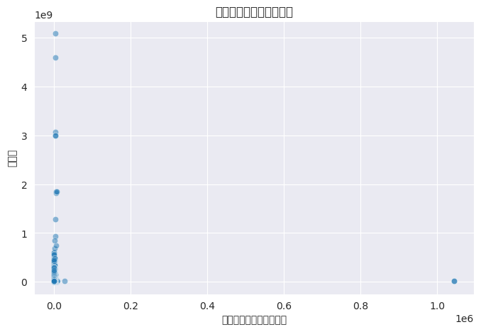
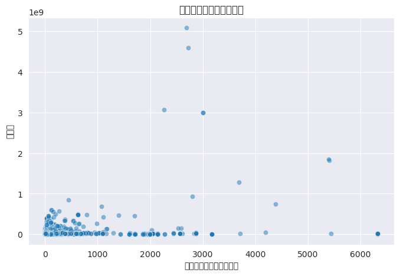

## 房價預測模型

台灣實價登入資料之房價預測

### 1. import 函式庫

```python
import pandas as pd
import numpy as np
import matplotlib.pyplot as plt
import seaborn as sns
from sklearn.model_selection import train_test_split, KFold
from sklearn.preprocessing import StandardScaler, OneHotEncoder, LabelEncoder
from sklearn.compose import ColumnTransformer
from sklearn.decomposition import PCA
import xgboost as xgb
```

### 2. 讀取資料

載入訓練、驗證及測試資料集，這些資料存於 Excel 檔案中。

```python
train = pd.read_excel('HW/HousePricing/data/train.xlsx')
valid = pd.read_excel('HW/HousePricing/data/valid.xlsx')
test = pd.read_excel('HW/HousePricing/data/test-reindex-test.xlsx')
```

### 3. 資料欄位清理

移除不必要的欄位。
* 編號：只做為index 使用
* 解約情形：內容不重要
* 棟及號：資料太雜難處理且內容不一致
* 交易標的：已有相關性較高的土地、建物、車位移轉平方公尺
* 移轉層次：內容較雜
* 總樓層數：試了幾次發現相關性沒那麼大
* 非都市土地使用編定：已使用土地使用分區資料
* 有無管理組織：資料內容皆是"無"，沒有參考性
* 備註：內容太複雜
* 建案名稱：名稱重複性低，無法廣泛使用
* 建築完成年月：無資料
* 交易年月日：內容奇怪的數值很多，故先刪除
```python
columns_to_drop = ['編號', '解約情形', '棟及號', '交易標的', '移轉層次', '總樓層數', '非都市土地使用編定', '有無管理組織', '備註', '建案名稱', '建築完成年月', '交易年月日']
df_train = df_train.drop(columns_to_drop, axis=1)
df_valid = df_valid.drop(columns_to_drop, axis=1)
df_test = df_test.drop(columns_to_drop, axis=1)
```

### 4. 移除資料中的離群值

透過繪製散佈圖和 Z 分數方法來識別離群值，並移除三個標準差外的資料。

```python
# 移除離群值
from matplotlib import rcParams

rcParams['font.family'] = 'sans-serif'
rcParams['font.sans-serif'] = ['SimHei']  # 這裡以支持中文的字體 SimHei 為例
rcParams['axes.unicode_minus'] = False  # 避免負號顯示問題

def scatterplot(feature, df):
    
    pd.set_option('display.float_format', lambda x: '{:.2f}'.format(x))

    color = sns.color_palette()
    sns.set_style('darkgrid')
    
    # 將所有無法轉換為浮點數的值設置為 NaN，直接在原始 df 中操作
    df[feature] = pd.to_numeric(df[feature], errors='coerce')

    # 選擇移除含有 NaN 的行，並在原數據框中進行修改
    df.dropna(subset=[feature], inplace=True)

    plt.figure(figsize=(8, 5))  # 調整圖形大小

    sns.scatterplot(x=df[feature], y='總價元', data=df, alpha=0.5)

    # 設置個別圖的中文標題
    plt.title(f'{feature}', fontsize=12)

    plt.xlabel(feature)
    plt.ylabel('總價元')

    plt.show()

    # 返回已更改的數據框
    return df

#Z分數
def remove_outliers_zscore(df, column, threshold=3):
    mean = df[column].mean()
    std = df[column].std()
    return df[(df[column] >= mean - threshold * std) & (df[column] <= mean + threshold * std)]

# 針對多個 X 進行離群值處理
feature = '土地移轉總面積平方公尺'
df_train = scatterplot(feature, df_train)
df_train = remove_outliers_zscore(df_train, feature)
df_train = scatterplot(feature, df_train)
```
'土地移轉總面積平方公尺' 刪除離群值前


'土地移轉總面積平方公尺' 刪除離群值後


### 5. 處理空值

處理各欄位中的空值，例如合併不同的土地使用分區欄位，填充空值以保持資料一致性。

```python
# 合併土地使用分區，空值填充為 '其他'
df_train['總土地使用分區'] = df_train['都市土地使用分區'].combine_first(df_train['非都市土地使用分區']).fillna('其他')
df_valid['總土地使用分區'] = df_valid['都市土地使用分區'].combine_first(df_valid['非都市土地使用分區']).fillna('其他')
df_test['總土地使用分區'] = df_test['都市土地使用分區'].combine_first(df_test['非都市土地使用分區']).fillna('其他')
```

### 6. 特定資料處理

將多個欄位內容的轉換成數值，例如：以「縣市平均房價」和「主要用途平均價格」替換主要欄位，並標準化欄位內容，將類別資料轉為數值。

```python
# 使用地區對應的平均房價來替換 "縣市"
city_to_price = {'臺北市': 217000, '新北市': 70000, ...}
df_train['縣市'] = df_train['土地位置建物門牌'].str[:3]
df_train['平均房價'] = df_train['縣市'].replace(city_to_price)
# 同樣處理驗證及測試資料

# 使用用途價格替換 "主要用途" 並標準化
use_to_price = {'住家用': 60000, '商業用': 90000, ...}
df_train['主要用途'] = df_train['主要用途'].replace(use_to_price)
```

### 7. 主成分分析 (PCA)

利用 PCA 降低多維度欄位的資料維度 

* 三個移轉面積欄位
```python
area_features_train = df_train[['土地移轉總面積平方公尺', '建物移轉總面積平方公尺', '車位移轉總面積平方公尺']]
df_train['PCA_area'] = pca.fit_transform(area_features_train)
```
* 車位相關欄位
'車位類別'先轉為平均價格，再將'車位類別', '車位移轉總面積平方公尺', '車位單價元平方公尺'PCA處理
缺失值填入平均價格
```python
# parking_type_to_price 為車位類別平均價格 dict

# 定義處理函數
def process_parking_features(df):
    # 替換車位類別為對應的價格
    average_price = np.mean(list(parking_type_to_price.values()))
    df['車位類別'] = df['車位類別'].replace(parking_type_to_price)
    df['車位類別'] = df['車位類別'].fillna(average_price)

    # 處理缺失值
    df['車位移轉總面積平方公尺'] = df['車位移轉總面積平方公尺'].fillna(df['車位移轉總面積平方公尺'].median())
    df['車位總價元'] = df['車位總價元'].fillna(df['車位總價元'].median())

    # 計算車位單價（每平方公尺價格）
    df['車位單價元平方公尺'] = df['車位總價元'] / df['車位移轉總面積平方公尺']
    df['車位單價元平方公尺'] = df['車位單價元平方公尺'].replace([np.inf, -np.inf], np.nan).fillna(df['車位單價元平方公尺'].median())

    # 選擇需要進行 PCA 的特徵
    features = df[['車位類別', '車位移轉總面積平方公尺', '車位單價元平方公尺']]

    # 標準化
    scaler = StandardScaler()
    features_scaled = scaler.fit_transform(features)

    return features_scaled

parking_features_train = process_parking_features(df_train)
```


### 8. 新增特徵

創建新欄位以增強資料特徵的表現
* 計算建物面積x單價元
* 將房, 廳, 衛加總為'總間數'
* 交易筆棟數轉為'土地數量', '建物數量', '車位數量'三個欄位

```python
df_train['建物平方公尺x單價元'] = df_train['建物移轉總面積平方公尺'] * df_train['單價元平方公尺']
```
```python
# 使用正則表達式提取 '交易筆棟數' 中的數值
# 提取土地、建物、車位數量
df_train[['土地數量', '建物數量', '車位數量']] = df_train['交易筆棟數'].str.extract(r'土地(\d+)建物(\d+)車位(\d+)')
```
```python
# 1. 將 '建物現況格局-房', '建物現況格局-廳', '建物現況格局-衛' 轉換為數字類型
for col in ['建物現況格局-房', '建物現況格局-廳', '建物現況格局-衛']:
    df_train[col] = pd.to_numeric(df_train[col], errors='coerce')
    df_valid[col] = pd.to_numeric(df_valid[col], errors='coerce')
    df_test[col] = pd.to_numeric(df_test[col], errors='coerce')
    

# 2. 特徵工程
# 創建新特徵
df_train['總間數'] = df_train['建物現況格局-房'] + df_train['建物現況格局-廳'] + df_train['建物現況格局-衛']
```

### 9. 模型訓練與驗證

將資料集分為 X  和 y，使用 XGBoost 模型進行訓練，並設置參數。

```python
X_train = df_train.drop(columns=['總價元'])
y_train = df_train['總價元']
X_valid = df_valid.drop(columns=['總價元'])
y_valid = df_valid['總價元']

dtrain = xgb.DMatrix(X_train, label=y_train)
dvalid = xgb.DMatrix(X_valid, label=y_valid)

params = {
    'objective': 'reg:absoluteerror',  # 使用 MAE 回歸
    'learning_rate': 0.01,
    'max_depth': 10,
    'eval_metric': 'mae'
}

evallist = [(dtrain, 'train'), (dvalid, 'eval')]
model = xgb.train(params, dtrain, num_boost_round=3000, evals=evallist, early_stopping_rounds=50)
```

### 10. 預測及儲存結果

對測試集進行預測並將 kaggle 上傳資料儲存。

```python
predictions = model.predict(xgb.DMatrix(df_test))
result_df = pd.DataFrame({'編號': df_test.index + 1, '總價元': predictions})
result_df.to_csv('house_price_predictions.csv', index=False, encoding='utf-8-sig')
```